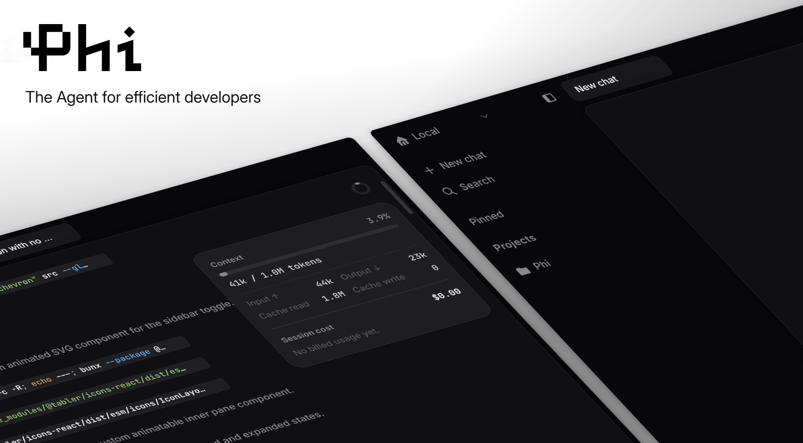

<p align="center">
  
</p>

<p align="center">
  <a href="https://github.com/solaymanehimite/phi"></a>
  <a href="https://github.com/vercel/next.js"></a>
</p>
Phi is a desktop coding agent powered by the Pi SDK.
Prompt models, run tools in your workspace, and shape the app to fit how you work.
<br/>
<br/>

- 🎨 Customizable
- ⚡ Fast
- ♿ Beautiful (definitely not Linear)

## Development

Requires [Bun](https://bun.sh).

```bash
bun install

# renderer (5173) + sidecar server (127.0.0.1:3001) + Electron, all at once
bun run electron:dev
```
